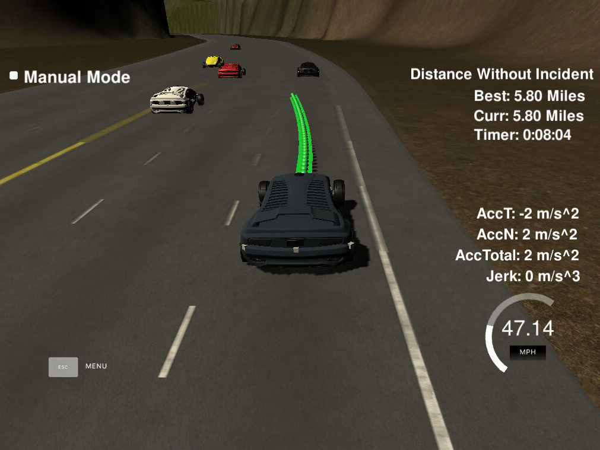

# Path Planning Project

## Reflections

### Overview

This project consist of coming up with a path planner that allows a so-called "ego car" to drive autonomously in a highway environment on a provided simulator.  In essences, the planner needs to determine a set of waypoints (a path) for the vehicle to follow.  Steering is controlled by the poistioning of the waypoints and speed is controlled through the spacing between waypoints.  The car visits each successive waypoint every 0.2 seconds, so waypoints that are spread further apart will cause the vehicle to drive faster.

By controlling the car in this manner, the planner is required to adhere to several stated rules and part of the given project [rubric](https://review.udacity.com/#!/rubrics/1971/view):

1. The car is able to drive at least 4.32 miles without incident (i.e. the rules below).

2. The car drives close to but no faster than the speed limit of 50 mph.

3. Maximum acceleration (10 m/s^2) and jerk (10 m/s^3) limits are not exceeded.

4. Car does not have collisions.

5. The car stays on the road and in its lane except for the time changing lanes which should be done within 3 seconds.

6. The car is able to change lanes smoothly and safely when it makes sense to do so.

   

   


## Implementation

I found it easier to implement the step to this project in reverse order of execution.  The idea here was first to try to get the ego car to driving in one lane using smooth trajectories and then use simple speed control to avoid it hitting any vehices ahead of it in its own lane. This was followed by determining how to smoothly change lanes.  Finally a planner was added that uses given sensor fusion data to predict the states and trajectories of other vehicles on the road and determine whether to stay in a given lane or make lane changes when it makes sense to do so and can be done safely.

### Trajectory Planner

In the QA video, we were provided with a methodology for generating smooth trajectories using a given spline function rather than using Jerk Minimizing Trajectories (JMT) described in previous lessons.  The spline function works by taking a set of points and using piecewise polynomial functions to produce a smooth curve that passes through all those points, known as knots.  Additionally, it was explained that determining the car's path points in Frenet coordinates and then converting to map coordinates, makes the task of keeping the ego car in its lane a trivial exercise (simply keep its d-coordinate constant).  

Smooth and jerk-miminized path planning consists of using whatever path waypoints already exist and then adding new points to that path.  In order to ensure smooth transitions, the last two points of the existing path are used when planning a new path.  If no previous points exist (like when we are just starting out), then the current state of the vehicle is used to determine its current and a previous path location tangent to its current position, and new point are added to that.  This keeps the path smooth.

The process of adding new points consists of using 5 points to define the spline function.  The first two points are the ones mentioned in the previous paragraph and to those, three point are added.  These points are 30, 60 and 90 meters respiecitvely ahead of the car, and by deriving a function for the d-position of these points in terms of the lane number, the car can be made to change lanes by simply changing the lane number.  The 3 points are determined using the following code in lines 154-156.

 `vector<double> next_wp0 = getXY(car_s + 30, 2 + 4*lane, map_waypoints_s, map_waypoints_x, map_waypoints_y);`

`
vector<double> next_wp1 = getXY(car_s + 60, 2 + 4*lane, map_waypoints_s, map_waypoints_x, map_waypoints_y);`

`
vector<double> next_wp2 = getXY(car_s + 90, 2 + 4*lane, map_waypoints_s, map_waypoints_x, map_waypoints_y);`

Each lane is 4 meters wide and the waypoints lie along the centerline of the road, so the above formulae will determine points that are in the center of the given lane.  The `getXY()` method converts the waypoints for Frenet coordinates back into map coordinates.

Given the 5 points above, a spline function can be uniquely determined.  All that is required is to pick points along the spline which can be done as done as we know how many points need to be picked and how far apart they should be (based on the car's speed).  

At any given time, our path planner stores a maximum of 50 waypoints.  As these waypoints are "consumed", the planner adds to these to bring the total back up to 50.  So each time the planner is called, it determines how many new points it needs to generate and, based upon the car's speed, it knows approximately how far apart to space them.  **So, upon being furnished with a lane and speed input, the trajectory planner adds waypoints (up to 50) to the path**.  Since this is detailed in the QA video, I copied the  methodology used therein and coded it in the main.cpp file.

### Behavior Planner

This module is coded as a separate class and its implementation can be found in the planner.cpp file.  It contains two methods, `predict()` and `plan(),` for the purpose of determining speed and steering controls.  These controls are then sent to the trajectory planner which will use this to generate waypoints.  

#### `Predict()`

In this method, the sensor_fusion array is parsed.  Each verhice's position is analyzed and projected forward in time based on its known state.  Based upon these projections and the ego car's anticipated trajectory, flags are set base.  The `plan()` method will use these flags to determine lane number and desired speed.

#### `Plan()`

Based upon flag settings, a set of heurisitics is implemented.  The ego car will stay in its lane and try to maintain 49.5 mph.  In the event that a car in ahead in its same lane and impeding its progress, the ego car will try to change lanes provided that an adjacent lane is clear and it is safe to do so (based upon a "safe zone" that must be clear of any vehicles).  If the ego car cannot change lanes, it must reduce its speed until the car ahead is a safe distance ahead, at which point it will begin increasing its speed to 49.5 mph.

The car will accelerate at its maximum acceleration (as defined in the project requirements) EXCEPT WHEN first starting up because this was found to violate the maximum jerk limits.  Accelerations are reduced when the vehicle is traveling less than 0.5 mph.

### Results

The planner was able to navigate the ego car around the highway for 7+ miles without incident and within the parameters defined in the project.  While the planner works, the car drove very defensively and perhaps a more intuitive planner would not need to drive quite so defensively.  Also, the method used to regulate speed was not ideal - fundamentally a P-only controller which caused large oscillations in the ego car's speed when it was trying to keep its distance from the car in front of it.  No doubt the PID controller that we will be building in the next project would go a long ways to fixing this problem.




------


#Project Description

# CarND-Path-Planning-Project

Self-Driving Car Engineer Nanodegree Program

### Simulator.
You can download the Term3 Simulator which contains the Path Planning Project from the [releases tab (https://github.com/udacity/self-driving-car-sim/releases/tag/T3_v1.2).  

To run the simulator on Mac/Linux, first make the binary file executable with the following command:
```shell
sudo chmod u+x {simulator_file_name}
```

### Goals
In this project your goal is to safely navigate around a virtual highway with other traffic that is driving +-10 MPH of the 50 MPH speed limit. You will be provided the car's localization and sensor fusion data, there is also a sparse map list of waypoints around the highway. The car should try to go as close as possible to the 50 MPH speed limit, which means passing slower traffic when possible, note that other cars will try to change lanes too. The car should avoid hitting other cars at all cost as well as driving inside of the marked road lanes at all times, unless going from one lane to another. The car should be able to make one complete loop around the 6946m highway. Since the car is trying to go 50 MPH, it should take a little over 5 minutes to complete 1 loop. Also the car should not experience total acceleration over 10 m/s^2 and jerk that is greater than 10 m/s^3.

#### The map of the highway is in data/highway_map.txt
Each waypoint in the list contains  [x,y,s,dx,dy] values. x and y are the waypoint's map coordinate position, the s value is the distance along the road to get to that waypoint in meters, the dx and dy values define the unit normal vector pointing outward of the highway loop.

The highway's waypoints loop around so the frenet s value, distance along the road, goes from 0 to 6945.554.

## Basic Build Instructions

1. Clone this repo.
2. Make a build directory: `mkdir build && cd build`
3. Compile: `cmake .. && make`
4. Run it: `./path_planning`.

Here is the data provided from the Simulator to the C++ Program

#### Main car's localization Data (No Noise)

["x"] The car's x position in map coordinates

["y"] The car's y position in map coordinates

["s"] The car's s position in frenet coordinates

["d"] The car's d position in frenet coordinates

["yaw"] The car's yaw angle in the map

["speed"] The car's speed in MPH

#### Previous path data given to the Planner

//Note: Return the previous list but with processed points removed, can be a nice tool to show how far along
the path has processed since last time. 

["previous_path_x"] The previous list of x points previously given to the simulator

["previous_path_y"] The previous list of y points previously given to the simulator

#### Previous path's end s and d values 

["end_path_s"] The previous list's last point's frenet s value

["end_path_d"] The previous list's last point's frenet d value

#### Sensor Fusion Data, a list of all other car's attributes on the same side of the road. (No Noise)

["sensor_fusion"] A 2d vector of cars and then that car's [car's unique ID, car's x position in map coordinates, car's y position in map coordinates, car's x velocity in m/s, car's y velocity in m/s, car's s position in frenet coordinates, car's d position in frenet coordinates. 

## Details

1. The car uses a perfect controller and will visit every (x,y) point it recieves in the list every .02 seconds. The units for the (x,y) points are in meters and the spacing of the points determines the speed of the car. The vector going from a point to the next point in the list dictates the angle of the car. Acceleration both in the tangential and normal directions is measured along with the jerk, the rate of change of total Acceleration. The (x,y) point paths that the planner recieves should not have a total acceleration that goes over 10 m/s^2, also the jerk should not go over 50 m/s^3. (NOTE: As this is BETA, these requirements might change. Also currently jerk is over a .02 second interval, it would probably be better to average total acceleration over 1 second and measure jerk from that.

2. There will be some latency between the simulator running and the path planner returning a path, with optimized code usually its not very long maybe just 1-3 time steps. During this delay the simulator will continue using points that it was last given, because of this its a good idea to store the last points you have used so you can have a smooth transition. previous_path_x, and previous_path_y can be helpful for this transition since they show the last points given to the simulator controller with the processed points already removed. You would either return a path that extends this previous path or make sure to create a new path that has a smooth transition with this last path.

## Tips

A really helpful resource for doing this project and creating smooth trajectories was using http://kluge.in-chemnitz.de/opensource/spline/, the spline function is in a single hearder file is really easy to use.

---

## Dependencies

* cmake >= 3.5
  
  * All OSes: [click here for installation instructions](https://cmake.org/install/)
* make >= 4.1
  * Linux: make is installed by default on most Linux distros
  * Mac: [install Xcode command line tools to get make](https://developer.apple.com/xcode/features/)
  * Windows: [Click here for installation instructions](http://gnuwin32.sourceforge.net/packages/make.htm)
* gcc/g++ >= 5.4
  * Linux: gcc / g++ is installed by default on most Linux distros
  * Mac: same deal as make - [install Xcode command line tools]((https://developer.apple.com/xcode/features/)
  * Windows: recommend using [MinGW](http://www.mingw.org/)
* [uWebSockets](https://github.com/uWebSockets/uWebSockets)
  * Run either `install-mac.sh` or `install-ubuntu.sh`.
  * If you install from source, checkout to commit `e94b6e1`, i.e.
    ```
    git clone https://github.com/uWebSockets/uWebSockets 
    cd uWebSockets
    git checkout e94b6e1
    ```

## Editor Settings

We've purposefully kept editor configuration files out of this repo in order to
keep it as simple and environment agnostic as possible. However, we recommend
using the following settings:

* indent using spaces
* set tab width to 2 spaces (keeps the matrices in source code aligned)

## Code Style

Please (do your best to) stick to [Google's C++ style guide](https://google.github.io/styleguide/cppguide.html).

## Project Instructions and Rubric

Note: regardless of the changes you make, your project must be buildable using
cmake and make!


## Call for IDE Profiles Pull Requests

Help your fellow students!

We decided to create Makefiles with cmake to keep this project as platform
agnostic as possible. Similarly, we omitted IDE profiles in order to ensure
that students don't feel pressured to use one IDE or another.

However! I'd love to help people get up and running with their IDEs of choice.
If you've created a profile for an IDE that you think other students would
appreciate, we'd love to have you add the requisite profile files and
instructions to ide_profiles/. For example if you wanted to add a VS Code
profile, you'd add:

* /ide_profiles/vscode/.vscode
* /ide_profiles/vscode/README.md

The README should explain what the profile does, how to take advantage of it,
and how to install it.

Frankly, I've never been involved in a project with multiple IDE profiles
before. I believe the best way to handle this would be to keep them out of the
repo root to avoid clutter. My expectation is that most profiles will include
instructions to copy files to a new location to get picked up by the IDE, but
that's just a guess.

One last note here: regardless of the IDE used, every submitted project must
still be compilable with cmake and make./

## How to write a README
A well written README file can enhance your project and portfolio.  Develop your abilities to create professional README files by completing [this free course](https://www.udacity.com/course/writing-readmes--ud777).

